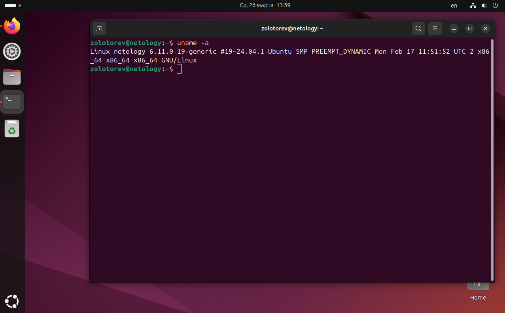

# Домашнее задание к занятию «Архитектура компьютера. Операционная система»
### Zolotorev N.D.

### Задание

Если вы работаете в **ОС Linux**, то запустите терминал и введите команды:
- uname -a
- lsb_release -a
- lscpu
- lshw

Что выводит каждая их этих команд?

*Ответ приведите в виде снимков экрана с комментарием в свободной форме*

### 1. uname -a

Команда uname -a используется для вывода всей системной информации. 

