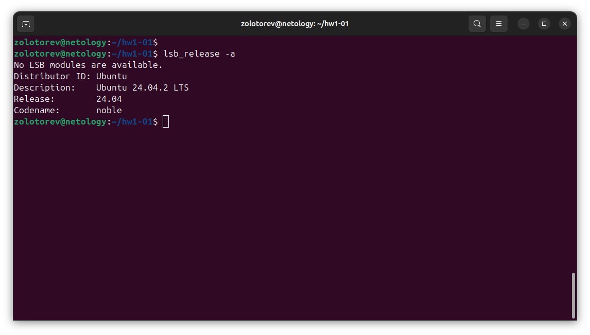
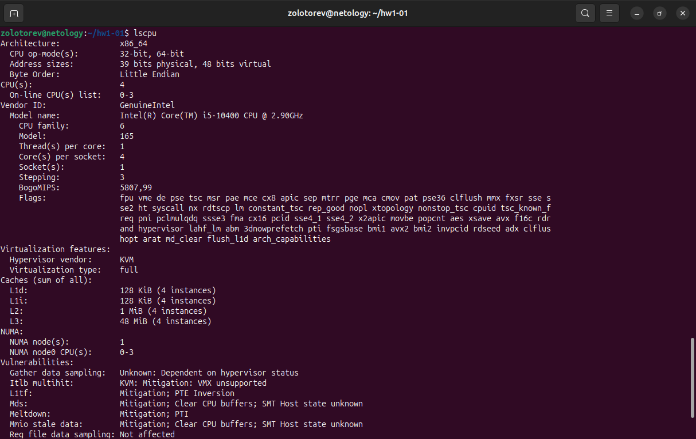
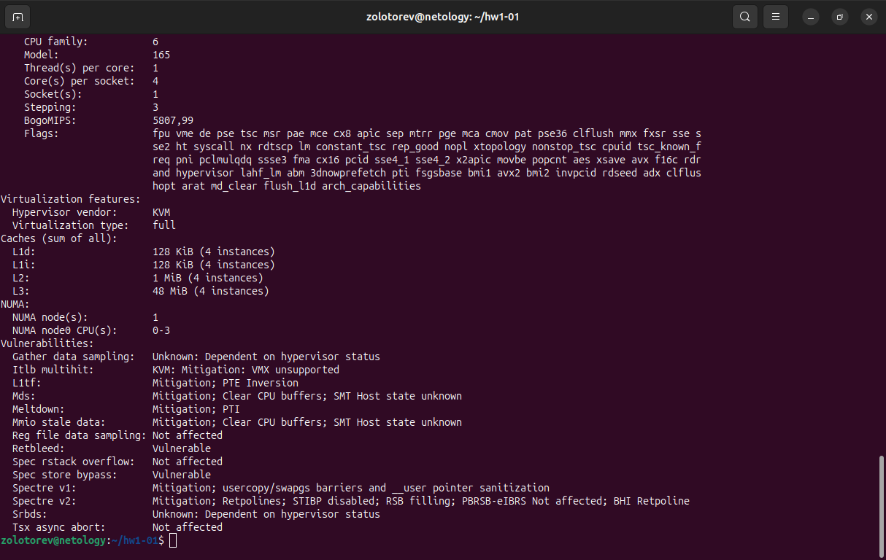
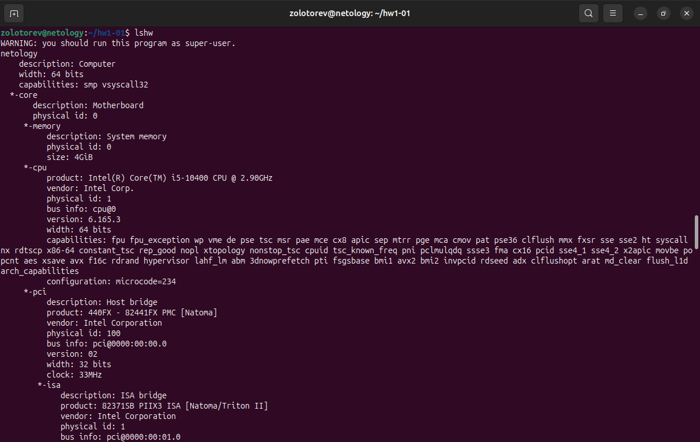
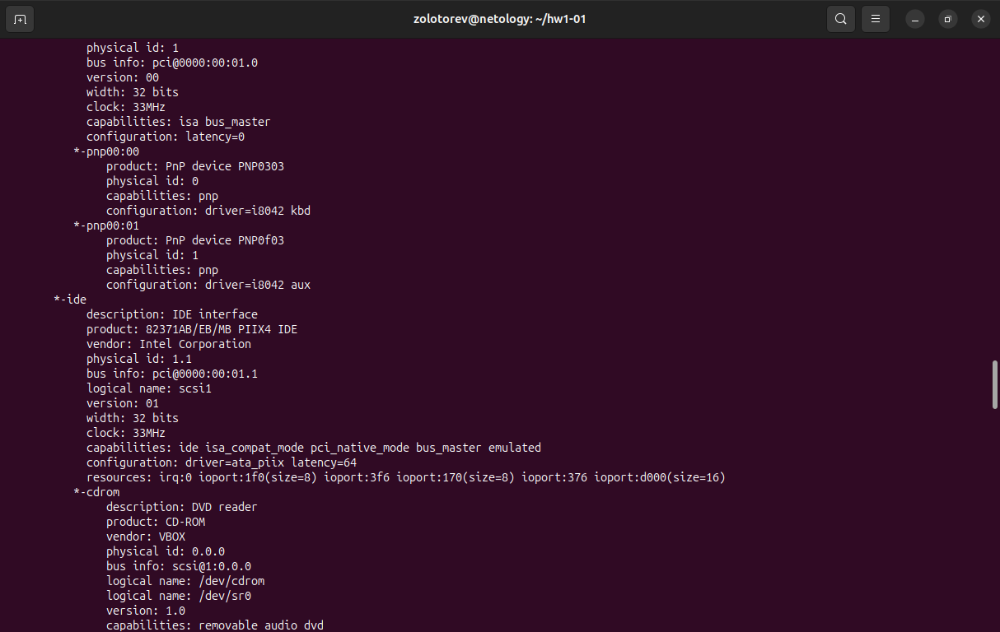
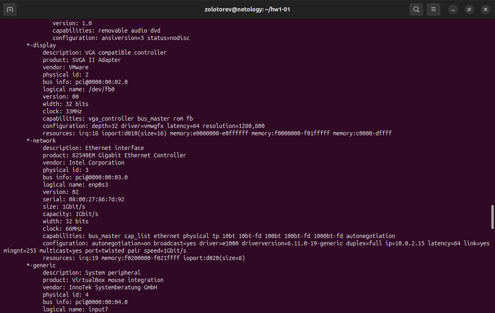
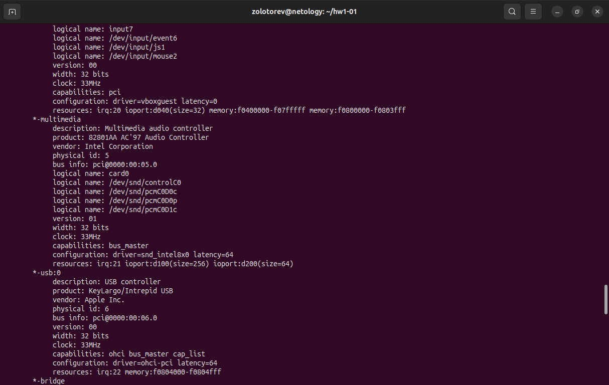
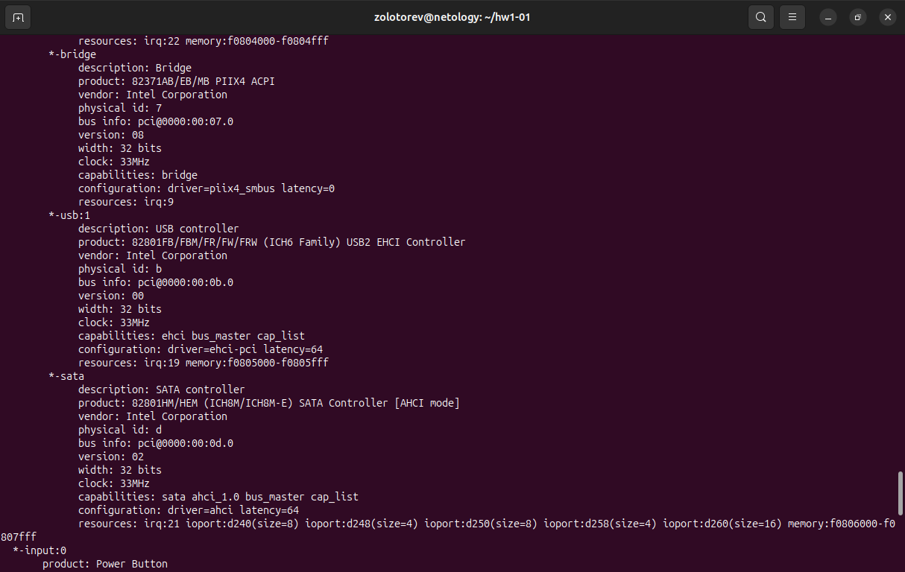
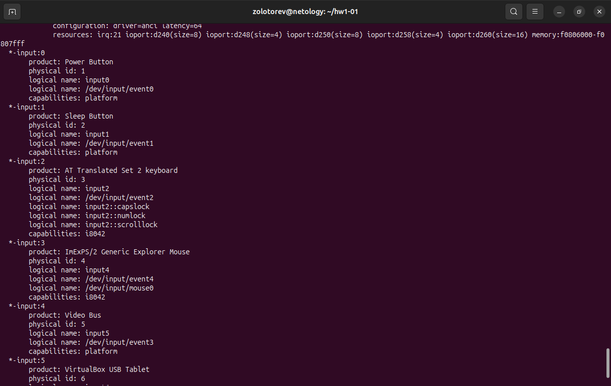
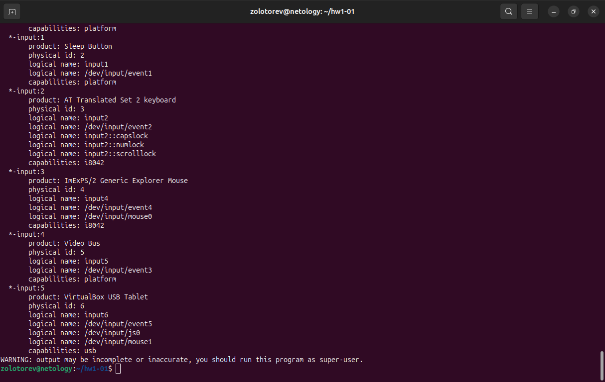

# Домашнее задание к занятию «Архитектура компьютера. Операционная система»
### Золоторев Н.Д.

### Задание

Если вы работаете в **ОС Linux**, то запустите терминал и введите команды:
- uname -a
- lsb_release -a
- lscpu
- lshw

Что выводит каждая их этих команд?

*Ответ приведите в виде снимков экрана с комментарием в свободной форме*

### 1. uname -a

Команда uname -a используется для вывода всей системной информации. 

### 2. lsb_release -a

Команда lsb_release -a выводит подробную информацию о версии операционной системы.

### 3. lscpu

Команда lscpu предоставляет всю информацию о процессоре, включая количество процессоров, ядер на процессор, потоков на ядро, семейство процессоров, модель и многое другое.

### 4. lshw

Команда lshw предназначена для отображения подробной информации об аппаратном обеспечении ПК. Она может отображать подробные данные о процессоре, оперативной памяти, дисках, сетевых интерфейсах, материнской плате, версии BIOS и т.д.
